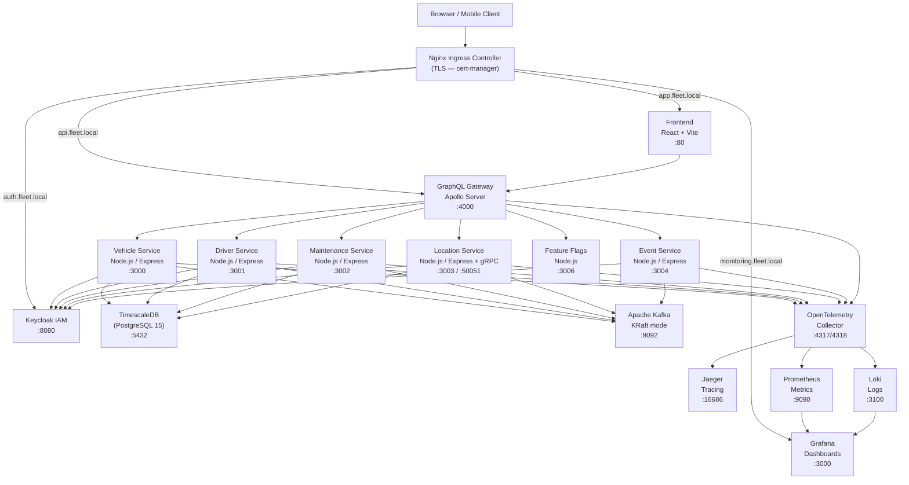

# Deployment Report — Vehicle Fleet Management System

> **University of Rouen — M1 GIL — 2025-2026**
> Supervisors: Lydia & Luc | Author: Cylia Bouazza

---

## 1. Executive Summary

The Vehicle Fleet Management System is a cloud-native application composed of five domain microservices (Vehicles, Drivers, Maintenance, Location/GPS, Events), a GraphQL API Gateway, a React frontend, and a full observability and security stack. The system is packaged as a production-grade Helm chart (`fleet-helm`) and deployed on Kubernetes.

In production, every workload runs with ≥2 replicas, strict resource quotas, zero-downtime rolling updates, and CPU-triggered autoscaling (HPA). All secrets are managed as Kubernetes Secret objects (base64). Inter-service traffic is restricted by NetworkPolicies. TLS is terminated at the Ingress layer via cert-manager. The observability stack (OpenTelemetry → Jaeger + Prometheus + Grafana + Loki) gives full distributed tracing, metrics, and log aggregation.

---

## 2. System Architecture Overview

### Architecture Diagram



### Service Inventory

| Service | Technology | Port | Database | Replicas (prod) |
|---|---|---|---|---|
| vehicle-service | Node.js 20, Express, REST | 3000 | PostgreSQL 15 (TimescaleDB) | 2–10 (HPA) |
| driver-service | Node.js 20, Express, REST | 3001 | PostgreSQL 15 (TimescaleDB) | 2–10 (HPA) |
| maintenance-service | Node.js 20, Express, REST | 3002 | PostgreSQL 15 (TimescaleDB) | 2–10 (HPA) |
| location-service | Node.js 20, Express + gRPC | 3003 / 50051 | TimescaleDB (hypertable) | 2–10 (HPA) |
| event-service | Node.js 20, Express, Kafka consumer | 3004 | None (event-driven) | 2–10 (HPA) |
| gestion-flotte-gateway | Apollo Server (GraphQL) | 4000 | None (aggregates services) | 2–10 (HPA) |
| frontend | React + Vite, served by Nginx | 80 | None | 2 |
| feature-flags | Node.js 20, Express | 3006 | None (JSON file) | 2 |
| keycloak | Keycloak 23.0 | 8080 | PostgreSQL (shared) | 2 |
| postgres (TimescaleDB) | timescale/timescaledb-ha:pg15 | 5432 | — | 1 (StatefulSet) |
| kafka | apache/kafka:3.8.1 (KRaft) | 9092 | — | 3 (StatefulSet) |

---

## 3. Infrastructure Decisions (ADR Format)

### ADR-001: Why Helm over raw Kubernetes manifests

| Field | Detail |
|---|---|
| **Status** | Accepted |
| **Context** | The system has 11 components, three environments (dev/staging/prod), and requires environment-specific configuration. Raw manifests would require duplicating YAML or maintaining fragile kustomize overlays. |
| **Decision** | Package the entire system as a Helm 3 chart with `values.yaml`, `values-dev.yaml`, and `values-prod.yaml`. Use `{{ .Values.* }}` for every configurable parameter. |
| **Consequences** | (+) Single source of truth for all K8s resources. (+) Atomic installs with `--atomic`. (+) Rollbacks via `helm rollback`. (+) Lifecycle hooks for DB migrations and Keycloak setup. (–) Helm adds a dependency; teams must learn Helm templating. |

### ADR-002: Why Kafka for inter-service communication

| Field | Detail |
|---|---|
| **Status** | Accepted |
| **Context** | Fleet events (vehicle state changes, geo-alerts, maintenance triggers) are asynchronous, high-volume, and need durable replay. HTTP calls between services would create tight coupling. |
| **Decision** | Use Apache Kafka 3.8.1 in KRaft mode (no ZooKeeper). Topics: `vehicle-events`, `driver-events`, `maintenance-events`, `geo-alerts`, `fleet-events`. |
| **Consequences** | (+) Decoupled producers/consumers. (+) Message durability and replay on consumer restart. (+) Scales to millions of GPS events/day. (–) Operational complexity. (–) At-least-once delivery requires idempotent consumers. |

### ADR-003: Why Keycloak for identity management

| Field | Detail |
|---|---|
| **Status** | Accepted |
| **Context** | The system requires JWT-based authentication, RBAC (admin/manager/viewer/driver roles), and multi-tenant realm support. Building a custom auth layer would be insecure and expensive. |
| **Decision** | Use Keycloak 23.0 as the IdP. Services validate JWTs locally; no service-to-service auth calls on hot paths. Realm `flotte` is imported via a Helm post-install hook. |
| **Consequences** | (+) Industry-standard OIDC/OAuth2. (+) Role claims embedded in JWT — no extra DB lookup. (+) Admin UI for user management. (–) Keycloak is heavy (requires its own DB). (–) Startup time is long (~90s). |

### ADR-004: Why TimescaleDB for GPS data

| Field | Detail |
|---|---|
| **Status** | Accepted |
| **Context** | The location service ingests continuous GPS coordinates from vehicles. Standard PostgreSQL tables degrade in query performance for time-series data over millions of rows. |
| **Decision** | Use `timescale/timescaledb-ha:pg15-latest`. GPS coordinates stored in a hypertable partitioned by `recorded_at`. All services share the same PostgreSQL instance with separate schemas. |
| **Consequences** | (+) Hypertables compress time-series data automatically. (+) Continuous aggregates for trajectory analytics. (+) Drop-in PostgreSQL compatibility. (–) Single DB instance is a SPOF; mitigated by TimescaleDB HA in production. |

### ADR-005: Why OpenTelemetry as the observability standard

| Field | Detail |
|---|---|
| **Status** | Accepted |
| **Context** | Five services need distributed tracing, metrics, and logs. Vendor-specific SDKs (Datadog, New Relic) lock the team in. Manual Prometheus instrumentation per service is repetitive. |
| **Decision** | All services export to an OpenTelemetry Collector (OTLP endpoint). The Collector fans out to Jaeger (traces), Prometheus (metrics), and Loki (logs). |
| **Consequences** | (+) Vendor-neutral — switch backends without changing application code. (+) Single SDK for traces + metrics + logs. (+) W3C trace context propagated automatically across service boundaries. (–) OTel Collector is an extra component to operate. |

---

## 4. Deployment Strategy

### Rolling Update (Zero Downtime)

All Deployments use `strategy: RollingUpdate` with `maxSurge: 1, maxUnavailable: 0`. This means:

1. Kubernetes creates 1 new pod (the updated version) while all old pods remain running.
2. The new pod must pass its `readinessProbe` before traffic is routed to it.
3. Only after the new pod is ready does Kubernetes terminate 1 old pod.
4. The cycle repeats until all pods are updated.

Because `maxUnavailable: 0`, the service is never at reduced capacity during rollouts. PodDisruptionBudgets (`minAvailable: 1`) additionally protect against simultaneous node drains.

### Blue/Green Deployment (with Helm)

A Blue/Green deployment can be achieved by deploying two full releases side-by-side and switching the Ingress:

```bash
# Deploy Green (new version)
helm upgrade --install fleet-green ./fleet-helm -f values-prod.yaml \
  --set vehicleService.image.tag=v2.0.0 \
  --set gateway.image.tag=v2.0.0 \
  -n fleet-prod

# Smoke-test Green
kubectl run smoke --rm -it --image=curlimages/curl -- curl http://gateway-green:4000/health

# Switch Ingress traffic to Green
kubectl patch ingress fleet-helm-gateway -n fleet-prod \
  --type='json' -p='[{"op":"replace","path":"/spec/rules/0/http/paths/0/backend/service/name","value":"gateway-green"}]'

# Drain and delete Blue
helm uninstall fleet-blue -n fleet-prod
```

Alternatively, use `nginx.ingress.kubernetes.io/canary: "true"` annotations for gradual traffic shifting (10% → 50% → 100%).

### Rollback Procedure

```bash
# 1. Identify the release history
helm history fleet -n fleet-prod

# 2. Rollback to last stable revision (revision 0 = previous)
helm rollback fleet 0 -n fleet-prod

# 3. Verify pods are healthy
kubectl rollout status deployment/vehicle-service -n fleet-prod
kubectl rollout status deployment/driver-service -n fleet-prod
kubectl rollout status deployment/gateway -n fleet-prod

# 4. Verify services respond
kubectl exec -it deploy/gateway -n fleet-prod -- wget -qO- http://localhost:4000/health

# 5. Check Kafka consumer lag hasn't grown
kubectl exec -it kafka-0 -n fleet-prod -- \
  /opt/kafka/bin/kafka-consumer-groups.sh --bootstrap-server localhost:9092 \
  --describe --all-groups
```

---

## 5. Security Hardening

### Security Measures Table

| Security Measure | Implementation | Helm Value Key |
|---|---|---|
| Non-root containers | `runAsNonRoot: true`, `runAsUser: 1001` | `podSecurityContext.runAsNonRoot` |
| Read-only root filesystem | `readOnlyRootFilesystem: true` | `securityContext.readOnlyRootFilesystem` |
| No privilege escalation | `allowPrivilegeEscalation: false` | `securityContext.allowPrivilegeEscalation` |
| Drop all Linux capabilities | `capabilities.drop: [ALL]` | `securityContext.capabilities.drop` |
| Secrets as K8s Secrets | `kind: Secret`, base64 values | `secrets.*` |
| TLS Ingress | cert-manager `letsencrypt-prod` issuer | `ingress.tls.enabled` |
| Network isolation | `NetworkPolicy` per service | `networkPolicy.enabled` |
| JWT auth | Keycloak OIDC, validated per service | `global.keycloak.*` |
| No ServiceAccount token automount | `automountServiceAccountToken: false` | `serviceAccount.create` |

### mTLS Between Services

mTLS can be added by installing Istio (or Linkerd) as a service mesh:

```bash
# Install Istio
istioctl install --set profile=production

# Enable strict mTLS in the fleet namespace
kubectl apply -f - <<EOF
apiVersion: security.istio.io/v1beta1
kind: PeerAuthentication
metadata:
  name: fleet-mtls
  namespace: fleet-prod
spec:
  mtls:
    mode: STRICT
EOF
```

Each service's pod gets an Envoy sidecar injected automatically. The sidecar handles mTLS certificate rotation via SPIFFE/X.509. No application code changes are required.

### Secrets Management Approach

In production, replace the Helm-managed Secrets with External Secrets Operator:

```yaml
# external-secrets approach (recommended for prod)
apiVersion: external-secrets.io/v1beta1
kind: ExternalSecret
metadata:
  name: fleet-postgres-secret
spec:
  secretStoreRef:
    name: vault-backend   # or AWS Secrets Manager, Azure KeyVault
    kind: ClusterSecretStore
  target:
    name: fleet-helm-postgres-secret
  data:
    - secretKey: POSTGRES_PASSWORD
      remoteRef:
        key: fleet/postgres
        property: password
```

### RBAC Matrix

| Role | Allowed Services | Kubernetes Permissions |
|---|---|---|
| `fleet-admin` | All services | `get, list, watch, create, update, delete` on all fleet resources |
| `fleet-manager` | vehicle, driver, maintenance, gateway | `get, list, create, update` — no delete |
| `fleet-viewer` | gateway (read-only GraphQL queries) | `get, list` on Pods, Services |
| `fleet-driver` | gateway (own records only) | `get` — filtered by driver ID claim |
| CI/CD Service Account | None (cluster access) | `apply` on fleet namespace only |

---

## 6. Observability Stack

### Tool Coverage

| Tool | What It Covers | Alert Examples |
|---|---|---|
| **OpenTelemetry Collector** | Receives traces, metrics, logs from all services; fans out to backends | n/a (pipeline component) |
| **Jaeger** | Distributed traces across all service hops | `p99 latency > 2s on /graphql`, `trace error rate > 1%` |
| **Prometheus** | System and business metrics, HPA data source | `CPU > 80% for 5m`, `pod restart count > 3`, `Kafka consumer lag > 1000` |
| **Grafana** | Unified dashboards for metrics + logs + traces | `SLO breach: 99.9% availability violated`, `DB connections exhausted` |
| **Loki** | Log aggregation from all pods (via Promtail) | `ERROR log rate spike`, `OOM kill detected in logs` |

### Key Prometheus Metrics per Service

| Service | Key Metrics |
|---|---|
| vehicle-service | `http_request_duration_seconds`, `vehicle_crud_operations_total`, `db_query_duration_seconds` |
| driver-service | `http_request_duration_seconds`, `driver_assignments_total`, `auth_validation_errors_total` |
| maintenance-service | `http_request_duration_seconds`, `maintenance_scheduled_total`, `overdue_maintenance_count` |
| location-service | `gps_coordinates_ingested_total`, `grpc_server_duration_seconds`, `geo_alert_triggered_total` |
| event-service | `kafka_consumer_lag`, `events_processed_total`, `event_processing_errors_total` |
| gateway | `graphql_query_duration_seconds`, `graphql_errors_total`, `upstream_service_failures_total` |
| kafka | `kafka_consumer_lag_sum`, `kafka_producer_request_rate`, `kafka_log_size` |

### Grafana Dashboard Descriptions

| Dashboard | Purpose |
|---|---|
| **Fleet Overview** | Golden signals (latency, traffic, errors, saturation) for all 5 services + gateway |
| **GPS / Location Heatmap** | Real-time vehicle positions on a world map, trail density, geo-alert frequency |
| **Kafka Consumer Lag** | Consumer group lag per topic, message throughput, partition distribution |
| **Database Performance** | Query duration histograms, active connections, TimescaleDB compression ratio |
| **Kubernetes Cluster Health** | Node CPU/RAM, pod restart counts, HPA scaling events, PVC usage |
| **Security & Auth** | Keycloak login success/failure rates, JWT validation errors, RBAC denials |

---

## 7. Performance & Scalability

### HPA Configuration Rationale

All microservices are configured with `cpuUtilization: 70%`. This threshold leaves a 30% headroom before pod saturation, giving time for the HPA controller to spin up new pods (typical cold-start: ~15s for Node.js) before the existing pods are overwhelmed.

The location-service uses `cpuUtilization: 65%` because GPS ingestion is CPU-bound (coordinate parsing, TimescaleDB upserts, Kafka publishing in tight loops).

```
minReplicas: 2   — always HA, survives one pod failure
maxReplicas: 10  — caps cluster resource usage; tune up if needed
```

### Expected Load Benchmarks

| Service | Baseline RPS | Peak RPS | p99 Latency (target) | Scale trigger |
|---|---|---|---|---|
| vehicle-service | 50 | 500 | < 200ms | 2→5 pods at 350 RPS |
| driver-service | 30 | 300 | < 200ms | 2→4 pods at 200 RPS |
| maintenance-service | 10 | 100 | < 500ms | 2→3 pods at 70 RPS |
| location-service | 500 GPS/s | 5,000 GPS/s | < 100ms | 2→8 pods at 3,000 GPS/s |
| event-service | 200 events/s | 2,000 events/s | < 50ms (Kafka) | 2→6 pods at 1,200 events/s |
| gateway (GraphQL) | 100 | 1,000 | < 500ms | 2→6 pods at 700 RPS |

### Kafka Partition Strategy

| Topic | Partitions | Replication Factor | Key Strategy |
|---|---|---|---|
| `vehicle-events` | 6 | 3 | `vehicle_id` — ordered per vehicle |
| `driver-events` | 4 | 3 | `driver_id` — ordered per driver |
| `maintenance-events` | 4 | 3 | `vehicle_id` — correlated with vehicle |
| `geo-alerts` | 12 | 3 | `vehicle_id` — high-throughput GPS |
| `fleet-events` | 6 | 3 | `event_type` — fan-out pattern |

---

## 8. Known Limitations & Future Improvements

| Area | Current Limitation | Planned Improvement |
|---|---|---|
| Database | Single TimescaleDB instance (SPOF) | Deploy TimescaleDB HA with streaming replication |
| Keycloak | `start-dev` mode (no clustering) | Use Keycloak Operator with PostgreSQL HA for prod |
| Secrets | Base64 in Helm values (rotated manually) | Integrate External Secrets Operator + HashiCorp Vault |
| mTLS | Not configured (plain HTTP between pods) | Install Istio service mesh for transparent mTLS |
| CI/CD | Manual `helm upgrade` | Implement ArgoCD GitOps — PRs auto-deploy to staging |
| Load testing | No automated load tests | Add K6 load test suite to CI pipeline |
| Multi-tenancy | Single realm for all clients | Separate Keycloak realm per client organization |
| Kafka KRaft | Single broker (no HA) | 3-broker KRaft cluster (already in values-prod.yaml) |
| Location Service gRPC | No TLS on gRPC channel | Add gRPC TLS via cert-manager + Istio |

---

## 9. Deployment Checklist

```
Pre-Deployment
- [ ] Docker images built and pushed to registry for all 8 services
- [ ] Image tags pinned (not "latest") in values-prod.yaml
- [ ] Kubernetes cluster version ≥ 1.25 confirmed
- [ ] Helm 3.12+ installed on CI runner
- [ ] cert-manager 1.13+ installed in cluster
- [ ] Nginx Ingress Controller deployed
- [ ] Metrics server deployed (required for HPA)
- [ ] DNS records created: api.fleet.local, auth.fleet.local, monitoring.fleet.local, app.fleet.local
- [ ] Namespace created: kubectl create namespace fleet-prod
- [ ] Postgres secret values (base64) prepared securely

Deployment
- [ ] helm lint ./fleet-helm (0 errors)
- [ ] helm install --dry-run --debug fleet ./fleet-helm -f values-prod.yaml -n fleet-prod (inspect output)
- [ ] helm upgrade --install fleet ./fleet-helm -f values-prod.yaml -n fleet-prod --atomic --timeout 5m
- [ ] Verify all pods Running: kubectl get pods -n fleet-prod
- [ ] Verify Ingress TLS certificate issued: kubectl describe certificate fleet-tls-prod -n fleet-prod
- [ ] Check Keycloak realm import job completed: kubectl get jobs -n fleet-prod
- [ ] Verify DB migration job completed: kubectl get jobs -n fleet-prod

Post-Deployment Validation
- [ ] Health check all services: curl https://api.fleet.local/health
- [ ] Login flow: open https://auth.fleet.local → login with admin/admin → verify token
- [ ] GraphQL playground: open https://api.fleet.local/graphql → run { vehicles { id } }
- [ ] Grafana accessible: open https://monitoring.fleet.local → check all dashboards
- [ ] Jaeger traces flowing: navigate to Jaeger UI → search for fleet-gateway service
- [ ] Kafka topics created: kubectl exec kafka-0 -n fleet-prod -- kafka-topics.sh --list --bootstrap-server localhost:9092
- [ ] HPA active: kubectl get hpa -n fleet-prod

Rollback (if needed)
- [ ] helm history fleet -n fleet-prod
- [ ] helm rollback fleet 0 -n fleet-prod
- [ ] kubectl get pods -n fleet-prod (verify rollback complete)
```

---

## 10. Authors & Academic Context

| Field | Detail |
|---|---|
| **Institution** | University of Rouen — IUT — Département Informatique |
| **Program** | M1 GIL (Génie Informatique et Logiciel) — 2025-2026 |
| **Course** | Architecture des Systèmes Distribués — XML & Web Services |
| **Supervisors** | Lydia & Luc |
| **Author** | Cylia Bouazza (bouazzacylia06@gmail.com) |
| **Repository** | https://github.com/CyliaBouazza/gestion-de-flotte-automobile |
| **Deliverable** | M3 — Production Deployment & Infrastructure |
| **Date** | April 2026 |

This project demonstrates the design, implementation, and deployment of a production-grade microservices system covering:
- Domain-driven service decomposition (5 bounded contexts)
- Event-driven architecture with Apache Kafka
- Identity federation with Keycloak OIDC/RBAC
- Time-series data management with TimescaleDB
- Full observability with the OpenTelemetry standard
- Infrastructure-as-Code with Helm 3 on Kubernetes
