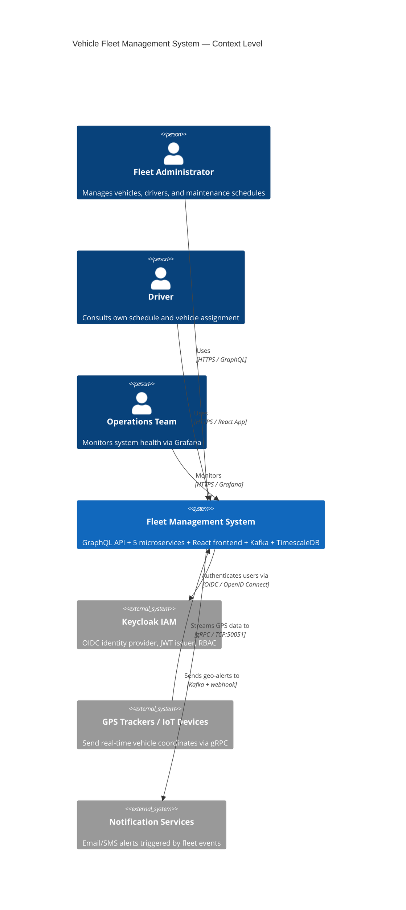
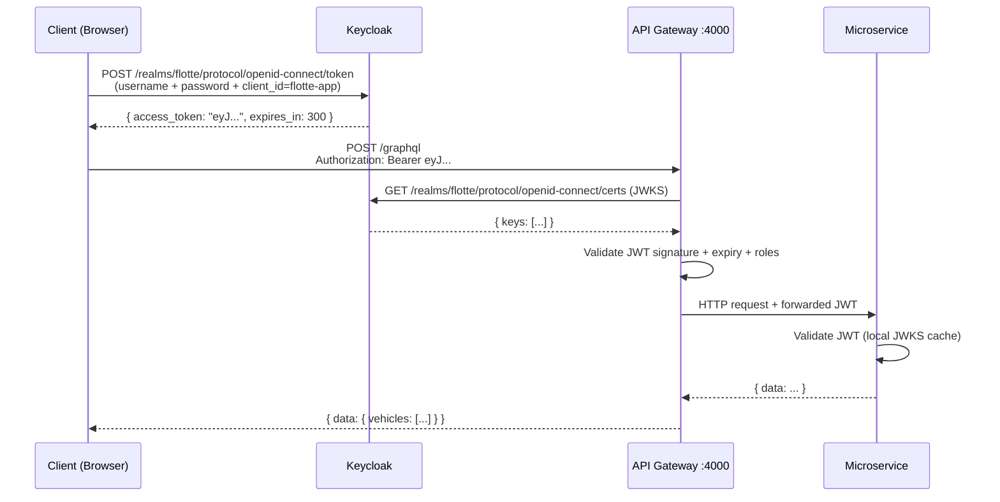

# Fleet Management System

[](https://github.com/CyliaBouazza/gestion-de-flotte-automobile/actions)
[](./LICENSE)
[](https://kubernetes.io)
[](https://helm.sh)
[](https://nodejs.org)

---

## Overview

The Vehicle Fleet Management System is a production-grade, cloud-native application built with a microservices architecture. It provides real-time tracking, management, and analytics for vehicle fleets. The system exposes a unified GraphQL API Gateway that aggregates five domain services: Vehicles (CRUD and status), Drivers (assignment and licensing), Maintenance (scheduling and history), Location (real-time GPS with TimescaleDB and gRPC streaming), and Events (Kafka-driven audit log). Security is handled by Keycloak (OIDC/JWT/RBAC). The full observability stack uses OpenTelemetry, Jaeger, Prometheus, Grafana, and Loki. The entire system is packaged as a Helm 3 chart for Kubernetes deployment.

---

## Architecture

### C4 Context Diagram



### Quick Service Table

| Service | Port | Role |
|---|---|---|
| vehicle-service | 3000 | Vehicle CRUD, status management |
| driver-service | 3001 | Driver profiles, license tracking |
| maintenance-service | 3002 | Maintenance scheduling, history |
| location-service | 3003 / 50051 | Real-time GPS, trajectory, geo-alerts |
| event-service | 3004 | Kafka consumer, event audit log |
| gestion-flotte-gateway | 4000 | GraphQL federation gateway |
| frontend | 80 | React dashboard |
| feature-flags | 3006 | Runtime feature toggles |
| keycloak | 8080 | Identity & access management |

---

## Prerequisites

### Required Tools (exact versions)

| Tool | Version | Install |
|---|---|---|
| Docker | 24.x+ | https://docs.docker.com/get-docker/ |
| Docker Compose | 2.20+ | Bundled with Docker Desktop |
| kubectl | 1.28+ | https://kubernetes.io/docs/tasks/tools/ |
| Helm | 3.12+ | https://helm.sh/docs/intro/install/ |
| Minikube or Kind | 1.30+ / 0.22+ | https://minikube.sigs.k8s.io/ |
| Node.js | 20.x LTS | https://nodejs.org/ |
| Git | 2.40+ | https://git-scm.com/ |

### Minimum Hardware

| Resource | Development | Production |
|---|---|---|
| CPU | 4 cores | 8 cores per node |
| RAM | 8 GB | 16 GB per node |
| Disk | 20 GB | 100 GB (SSD) |
| Nodes | 1 (Minikube) | 3+ (HA cluster) |

---

## Quick Start (5 steps)

```bash
# 1. Clone the repository
git clone https://github.com/CyliaBouazza/gestion-de-flotte-automobile.git
cd gestion-de-flotte-automobile

# 2. Start all services with Docker Compose (includes hot-reload)
docker compose up --build -d

# 3. Wait for health checks (~2 min), then verify
docker compose ps

# 4. Access the application
#    Frontend:          http://localhost
#    GraphQL Playground: http://localhost:4000/graphql
#    Keycloak Admin:    http://localhost:8080  (admin / admin)

# 5. Run end-to-end smoke test
bash e2e-saga-test.sh
```

---

## Project Structure

```
gestion-de-flotte-automobile/
├── services/                   # All 5 microservices
│   ├── vehicule-service/       # Vehicle CRUD + Kafka producer
│   ├── conducteur-service/     # Driver management
│   ├── maintenance-service/    # Maintenance scheduling
│   ├── localisation-service/   # GPS + TimescaleDB + gRPC
│   └── evenement-service/      # Kafka consumer event log
├── fleet-helm/                 # Production-grade Helm chart
│   ├── Chart.yaml              # Chart metadata
│   ├── values.yaml             # Default values
│   ├── values-dev.yaml         # Dev environment overrides
│   ├── values-prod.yaml        # Production overrides (≥2 replicas)
│   └── templates/              # K8s resource templates
│       ├── _helpers.tpl        # Helm helper functions
│       ├── configmap.yaml      # Shared non-sensitive config
│       ├── secrets.yaml        # DB + Keycloak credentials
│       ├── ingress.yaml        # TLS ingress (cert-manager)
│       ├── networkpolicy.yaml  # Network isolation rules
│       ├── serviceaccount.yaml # K8s service account
│       ├── *-deployment.yaml   # Deployments (one per service)
│       ├── *-svc-hpa-pdb.yaml  # Services + HPA + PDB
│       ├── infra/              # StatefulSets: Kafka, PostgreSQL, Keycloak
│       └── hooks/              # Pre/post install jobs
├── helm/                       # Legacy Helm charts (superseded by fleet-helm)
├── frontend/                   # React + Vite application
│   ├── src/                    # Components, hooks, pages
│   ├── cypress/                # E2E Cypress tests
│   └── Dockerfile              # Multi-stage nginx build
├── keycloak/                   # Keycloak realm configuration
│   └── realm-flotte.json       # Realm + clients + roles export
├── db/                         # Database initialization scripts
│   ├── init-vehicles.sql       # Vehicle schema + indexes
│   ├── init-localisation.sql   # TimescaleDB hypertable
│   └── seed.sql                # Sample fleet data
├── k8s/                        # Raw Kubernetes manifests (reference)
├── tests/                      # Integration and e2e test suites
├── scripts/                    # Utility scripts
├── docs/                       # Architecture documentation
├── docker-compose.yaml         # Local development stack
├── gestion-flotte.js           # Apollo Gateway entry point
├── gestion-flotte.Dockerfile   # Gateway Docker image
├── tracing.js                  # OpenTelemetry setup
├── metrics.js                  # Prometheus metrics setup
├── DEPLOYMENT_REPORT.md        # Full deployment report (this project)
└── RUNBOOK-LANCEMENT-SERVICES.md # Operations runbook
```

---

## Services Documentation

### Vehicle Service

**Purpose:** Manages the vehicle fleet — creation, updates, deletion, and real-time status tracking (available/in_use/maintenance/out_of_service).

**Tech stack:** Node.js 20, Express 4, PostgreSQL (pg), KafkaJS, OpenTelemetry SDK

**API Endpoints:**

| Method | Path | Auth Required | Description |
|---|---|---|---|
| GET | /health | No | Health check |
| GET | /metrics | No | Prometheus metrics |
| GET | /vehicles | JWT | List all vehicles (paginated) |
| GET | /vehicles/:id | JWT | Get vehicle by ID |
| POST | /vehicles | JWT + fleet-manager | Create new vehicle |
| PUT | /vehicles/:id | JWT + fleet-manager | Update vehicle |
| DELETE | /vehicles/:id | JWT + fleet-admin | Delete vehicle |
| PATCH | /vehicles/:id/status | JWT + fleet-manager | Update status only |

**Kafka Events:**

| Direction | Topic | Event | Payload |
|---|---|---|---|
| Produces | `vehicle-events` | `vehicle.created` | `{vehicleId, plate, type, ...}` |
| Produces | `vehicle-events` | `vehicle.status.changed` | `{vehicleId, oldStatus, newStatus}` |
| Produces | `vehicle-events` | `vehicle.deleted` | `{vehicleId}` |

**Environment Variables:**

| Variable | Default | Description |
|---|---|---|
| PORT | 3000 | HTTP server port |
| POSTGRES_HOST | postgres | Database hostname |
| POSTGRES_PORT | 5432 | Database port |
| POSTGRES_DB | fleet | Database name |
| POSTGRES_USER | — | DB username (from Secret) |
| POSTGRES_PASSWORD | — | DB password (from Secret) |
| KAFKA_BROKER | kafka:9092 | Kafka bootstrap server |
| KEYCLOAK_URL | http://keycloak:8080 | Keycloak base URL |
| KEYCLOAK_REALM | flotte | Keycloak realm |
| OTEL_EXPORTER_OTLP_ENDPOINT | http://otel-collector:4318 | OTel collector endpoint |

---

### Driver Service

**Purpose:** Manages driver profiles, license information, assignment to vehicles, and availability status.

**Tech stack:** Node.js 20, Express 4, PostgreSQL, KafkaJS, OpenTelemetry SDK

**API Endpoints:**

| Method | Path | Auth Required | Description |
|---|---|---|---|
| GET | /health | No | Health check |
| GET | /drivers | JWT | List all drivers |
| GET | /drivers/:id | JWT | Get driver by ID |
| POST | /drivers | JWT + fleet-manager | Create driver profile |
| PUT | /drivers/:id | JWT + fleet-manager | Update driver |
| DELETE | /drivers/:id | JWT + fleet-admin | Delete driver |
| POST | /drivers/:id/assign | JWT + fleet-manager | Assign driver to vehicle |

**Kafka Events:**

| Direction | Topic | Event | Payload |
|---|---|---|---|
| Produces | `driver-events` | `driver.assigned` | `{driverId, vehicleId, startDate}` |
| Produces | `driver-events` | `driver.unassigned` | `{driverId, vehicleId}` |
| Consumes | `vehicle-events` | `vehicle.status.changed` | Update driver availability |

**Environment Variables:**

| Variable | Default | Description |
|---|---|---|
| PORT | 3001 | HTTP server port |
| POSTGRES_HOST | postgres | Database hostname |
| KAFKA_BROKER | kafka:9092 | Kafka bootstrap server |
| KEYCLOAK_URL | http://keycloak:8080 | Keycloak base URL |

---

### Maintenance Service

**Purpose:** Schedules, tracks, and reports vehicle maintenance operations (oil changes, inspections, repairs).

**Tech stack:** Node.js 20, Express 4, PostgreSQL, KafkaJS, OpenTelemetry SDK

**API Endpoints:**

| Method | Path | Auth Required | Description |
|---|---|---|---|
| GET | /health | No | Health check |
| GET | /maintenances | JWT | List all maintenance records |
| GET | /maintenances/:id | JWT | Get maintenance by ID |
| GET | /vehicles/:id/maintenances | JWT | Get vehicle's maintenance history |
| POST | /maintenances | JWT + fleet-manager | Schedule maintenance |
| PUT | /maintenances/:id | JWT + fleet-manager | Update maintenance record |
| PATCH | /maintenances/:id/complete | JWT + fleet-manager | Mark as completed |

**Kafka Events:**

| Direction | Topic | Event | Payload |
|---|---|---|---|
| Produces | `maintenance-events` | `maintenance.scheduled` | `{vehicleId, type, scheduledAt}` |
| Produces | `maintenance-events` | `maintenance.completed` | `{vehicleId, maintenanceId, completedAt}` |
| Consumes | `vehicle-events` | `vehicle.status.changed` | Trigger preventive maintenance check |

**Environment Variables:**

| Variable | Default | Description |
|---|---|---|
| PORT | 3002 | HTTP server port |
| POSTGRES_HOST | postgres | Database hostname |
| KAFKA_BROKER | kafka:9092 | Kafka bootstrap server |

---

### Location Service

**Purpose:** Ingests real-time GPS coordinates from vehicles via gRPC, stores them in TimescaleDB hypertables, computes trajectories, and triggers geo-alerts when vehicles leave defined zones.

**Tech stack:** Node.js 20, Express 4, gRPC (`@grpc/grpc-js`), TimescaleDB, KafkaJS, OpenTelemetry SDK

**API Endpoints:**

| Method | Path | Auth Required | Description |
|---|---|---|---|
| GET | /health | No | Health check |
| GET | /locations/latest | JWT | Latest position of all vehicles |
| GET | /locations/:vehicleId | JWT | Position history for a vehicle |
| GET | /locations/:vehicleId/trajectory | JWT | Full trajectory (GeoJSON) |
| POST | /locations | JWT (internal) | Ingest GPS coordinate (REST fallback) |
| gRPC | LocationService/StreamGPS | mTLS (IoT) | Bidirectional GPS stream |

**Kafka Events:**

| Direction | Topic | Event | Payload |
|---|---|---|---|
| Produces | `geo-alerts` | `geo.alert.outside_zone` | `{vehicleId, lat, lng, zoneId, timestamp}` |
| Produces | `geo-alerts` | `geo.alert.speeding` | `{vehicleId, speed, limit, timestamp}` |

**Environment Variables:**

| Variable | Default | Description |
|---|---|---|
| PORT | 3003 | HTTP server port |
| GRPC_PORT | 50051 | gRPC streaming port |
| TIMESCALEDB_HOST | postgres | TimescaleDB hostname |
| TIMESCALEDB_DB | fleet | Database name |
| KAFKA_GEO_ALERTS_TOPIC | geo-alerts | Kafka topic for alerts |

---

### Event Service

**Purpose:** Consumes all Kafka topics and builds an immutable, queryable audit log of all fleet events. Enables compliance reporting and incident reconstruction.

**Tech stack:** Node.js 20, Express 4, KafkaJS (consumer group), OpenTelemetry SDK

**API Endpoints:**

| Method | Path | Auth Required | Description |
|---|---|---|---|
| GET | /health | No | Health check |
| GET | /events | JWT | List recent events (paginated) |
| GET | /events/:id | JWT | Get event by ID |
| GET | /events/vehicle/:id | JWT | Events for a specific vehicle |
| GET | /events/type/:type | JWT | Events by type |

**Kafka Events:**

| Direction | Topic | Description |
|---|---|---|
| Consumes | `vehicle-events` | All vehicle lifecycle events |
| Consumes | `driver-events` | All driver assignment events |
| Consumes | `maintenance-events` | All maintenance events |
| Consumes | `geo-alerts` | All geo-fencing alerts |
| Consumes | `fleet-events` | Cross-domain fleet events |

**Environment Variables:**

| Variable | Default | Description |
|---|---|---|
| PORT | 3004 | HTTP server port |
| KAFKA_BROKER | kafka:9092 | Kafka bootstrap server |
| KAFKA_GROUP_ID | event-service-group | Consumer group ID |

---

## Infrastructure Components

**Apache Kafka (apache/kafka:3.8.1, KRaft mode):** The central event bus connecting all microservices. Runs in KRaft mode (no ZooKeeper dependency), with 5 topics. In production, 3 brokers provide replication factor 3 and leader election. Kafka persists data to a PVC (`10Gi` dev / `50Gi` prod).

**PostgreSQL / TimescaleDB (timescale/timescaledb-ha:pg15-latest):** Shared database server hosting all service schemas (`service_vehicles`, `service_localisation`, `service_drivers`, `service_maintenance`). The TimescaleDB extension is used exclusively by `location-service` for GPS hypertables. Schema isolation prevents cross-service direct queries. PVC: `10Gi` dev / `50Gi` prod on fast-ssd.

**Keycloak (quay.io/keycloak/keycloak:23.0):** Identity provider for the entire system. The `flotte` realm is imported automatically via a Helm `post-install` hook. It defines 4 roles (`fleet-admin`, `fleet-manager`, `fleet-viewer`, `fleet-driver`) and one public client (`flotte-app`). In production, Keycloak connects to PostgreSQL instead of its embedded H2 database.

**Redis:** Available as an optional cache layer for session data and rate limiting. Not enabled by default in the current Helm chart — can be added via the Bitnami Redis chart as a subchart dependency.

**OpenTelemetry Collector:** Receives OTLP traces and metrics from all 5 microservices and the gateway. Fan-out pipeline routes: traces → Jaeger, metrics → Prometheus, logs → Loki. The endpoint `http://otel-collector:4318` is injected into every pod via the shared ConfigMap.

---

## Development

### Run a Single Service Locally

```bash
# Example: vehicle-service
cd services/vehicule-service
npm install
# Start local Postgres + Kafka with Docker
docker compose up postgres kafka -d
# Run the service in dev mode (with nodemon hot-reload)
POSTGRES_HOST=localhost KAFKA_BROKER=localhost:9094 npm run dev
```

### Run All Services with Docker Compose

```bash
# Start the full stack (all services + infra)
docker compose up --build

# Watch logs for a specific service
docker compose logs -f vehicle-service

# Stop and remove volumes (full reset)
docker compose down -v
```

**`docker-compose.yaml` excerpt (key services):**
```yaml
services:
  postgres:
    image: timescale/timescaledb-ha:pg15-latest
    environment:
      POSTGRES_USER: flotte
      POSTGRES_PASSWORD: flotte123
      POSTGRES_DB: fleet
    volumes:
      - pgdata:/var/lib/postgresql/data
      - ./db/init-vehicles.sql:/docker-entrypoint-initdb.d/01-init-vehicles.sql
      - ./db/init-localisation.sql:/docker-entrypoint-initdb.d/02-init-localisation.sql
      - ./db/seed.sql:/docker-entrypoint-initdb.d/03-seed.sql

  kafka:
    image: apache/kafka:3.8.1
    ports:
      - "9094:9094"
    environment:
      KAFKA_NODE_ID: 1
      KAFKA_PROCESS_ROLES: broker,controller
      KAFKA_AUTO_CREATE_TOPICS_ENABLE: "true"

  gestion-flotte-gateway:
    build: { context: ., dockerfile: gestion-flotte.Dockerfile }
    ports:
      - "4000:4000"
    depends_on:
      vehicle-service: { condition: service_healthy }
      driver-service: { condition: service_healthy }
      maintenance-service: { condition: service_healthy }
      location-service: { condition: service_healthy }
      event-service: { condition: service_healthy }
```

### Run Tests

```bash
# Unit tests (all services)
npm test

# Unit tests for a specific service
cd services/vehicule-service && npm test

# Integration tests (requires running Docker Compose stack)
docker compose up -d
npm run test:integration

# E2E tests (Cypress — requires running frontend)
cd frontend
npx cypress run

# E2E saga test (shell script — tests full Kafka event chain)
bash e2e-saga-test.sh

# Load tests with K6
k6 run tests/load/vehicle-service.js --vus 50 --duration 60s
```

---

## Deployment

See [DEPLOYMENT_REPORT.md](./DEPLOYMENT_REPORT.md) for the full infrastructure analysis, ADRs, and security hardening details.

### Helm Commands Summary

```bash
# Lint the chart
helm lint ./fleet-helm

# Dry-run (inspect all generated manifests)
helm install --dry-run --debug fleet ./fleet-helm -f fleet-helm/values-dev.yaml -n fleet-dev

# Install in development environment
helm install fleet ./fleet-helm -f fleet-helm/values-dev.yaml -n fleet-dev --create-namespace

# Install / upgrade in production (atomic — rolls back on failure)
helm upgrade --install fleet ./fleet-helm -f fleet-helm/values-prod.yaml \
  -n fleet-prod --create-namespace \
  --atomic --timeout 5m \
  --set secrets.postgres.password="$(echo -n 'changeme' | base64)" \
  --set secrets.keycloak.adminPassword="$(echo -n 'changeme' | base64)"

# Rollback to previous release
helm rollback fleet 0 -n fleet-prod

# Uninstall (preserves PVCs by default)
helm uninstall fleet -n fleet-prod
```

### Access Each UI

| Service | Dev URL | Prod URL | Credentials |
|---|---|---|---|
| React Frontend | http://localhost | https://app.fleet.local | Keycloak login |
| GraphQL Playground | http://localhost:4000/graphql | https://api.fleet.local/graphql | Bearer JWT |
| Keycloak Admin | http://localhost:8080 | https://auth.fleet.local | admin / admin |
| Grafana | N/A (local OTel) | https://monitoring.fleet.local | admin / prom-operator |
| Jaeger UI | N/A | https://monitoring.fleet.local/jaeger | N/A |
| Prometheus | N/A | http://prometheus:9090 (internal) | N/A |

---

## API Reference

### GraphQL Playground

```
Dev:  http://localhost:4000/graphql
Prod: https://api.fleet.local/graphql
```

**Example query:**
```graphql
query GetFleetOverview {
  vehicles {
    id
    licensePlate
    status
    make
    model
    driver {
      id
      firstName
      lastName
    }
    lastLocation {
      latitude
      longitude
      recordedAt
    }
  }
}
```

### Auth Flow



---

## Testing

### Coverage Requirements

| Test Type | Tool | Target Coverage | Scope |
|---|---|---|---|
| Unit tests | Jest | > 80% | Business logic, validators, utilities |
| Integration tests | Jest + Supertest | > 70% | REST endpoints with real DB |
| E2E tests | Cypress | Critical paths | Frontend login, vehicle CRUD, map |
| E2E saga | Bash/curl | Full chain | Kafka event propagation end-to-end |
| Load tests | K6 | Baseline captured | 50–500 RPS per service |

### Load Tests with K6

```bash
# Install K6
brew install k6  # macOS
# or: sudo apt install k6  # Debian/Ubuntu

# Run vehicle service load test
k6 run tests/load/vehicle-service.js \
  --vus 50 \
  --duration 60s \
  --out json=results/vehicle-load.json

# Run full fleet load test (all services)
k6 run tests/load/fleet-full.js \
  --vus 100 \
  --duration 120s \
  --env BASE_URL=http://localhost:4000
```

---

## Troubleshooting

### Common Issues

| Issue | Symptom | Solution |
|---|---|---|
| Keycloak timeout on startup | Pods show `CrashLoopBackOff`, readiness probe fails for ~5 min | Increase `initialDelaySeconds` to 120. Keycloak + Liquibase migration takes 2–5 min on first boot. |
| Kafka `LEADER_NOT_AVAILABLE` | Services log `KafkaJSProtocolError` on startup | Kafka KRaft election takes ~30s. Use `depends_on` + health checks. Wait for `kafka:9092` to be reachable. |
| `read-only filesystem` errors in containers | Pods fail to start with `Permission denied` on `/tmp` | Mount `emptyDir` volumes for `/tmp`, `/var/cache/nginx`, `/var/run` as shown in templates. |
| HPA not scaling | `kubectl get hpa` shows `<unknown>/70%` | Metrics server not installed. Run: `minikube addons enable metrics-server` or install the Kubernetes metrics-server chart. |
| GraphQL 401 Unauthorized | All queries return `401` | JWT expired (default 5 min). Re-authenticate with Keycloak. Verify `KEYCLOAK_URL` matches the service's network-accessible URL (not localhost). |

### Check Logs

```bash
# Logs for a specific service (last 100 lines)
kubectl logs -n fleet-prod -l app.kubernetes.io/name=vehicle-service --tail=100

# Follow logs in real-time
kubectl logs -n fleet-prod -l app.kubernetes.io/name=gateway -f

# Check previous crashed container
kubectl logs -n fleet-prod pod/vehicle-service-xxxx --previous

# All pods in namespace
kubectl logs -n fleet-prod --selector app.kubernetes.io/part-of=fleet-management --tail=50
```

### Check Kafka Consumer Lag

```bash
# List consumer groups
kubectl exec -n fleet-prod kafka-0 -- \
  /opt/kafka/bin/kafka-consumer-groups.sh \
  --bootstrap-server localhost:9092 \
  --list

# Describe a specific group
kubectl exec -n fleet-prod kafka-0 -- \
  /opt/kafka/bin/kafka-consumer-groups.sh \
  --bootstrap-server localhost:9092 \
  --describe \
  --group event-service-group

# Check all topics and partitions
kubectl exec -n fleet-prod kafka-0 -- \
  /opt/kafka/bin/kafka-topics.sh \
  --bootstrap-server localhost:9092 \
  --list
```

---

## Contributing

### Git Flow

```
main          ← stable production branch
  └── develop ← integration branch
        ├── feat/add-vehicle-export
        ├── fix/kafka-reconnect-on-timeout
        ├── docs/update-deployment-guide
        └── chore/upgrade-node-20
```

### Branch Naming Convention

| Type | Pattern | Example |
|---|---|---|
| Feature | `feat/<description>` | `feat/add-vehicle-export` |
| Bug fix | `fix/<description>` | `fix/kafka-reconnect-on-timeout` |
| Documentation | `docs/<description>` | `docs/update-deployment-guide` |
| Chore / Infra | `chore/<description>` | `chore/upgrade-helm-chart` |
| Release | `release/v<semver>` | `release/v1.2.0` |

### Commit Convention (Conventional Commits)

```
feat(vehicle-service): add CSV export endpoint
fix(kafka): reconnect consumer on broker timeout
docs(readme): add K6 load test instructions
chore(deps): upgrade kafka to 3.8.1
test(location): add gRPC streaming integration test
```

### PR Checklist

```
- [ ] Branch follows naming convention
- [ ] Commits follow Conventional Commits format
- [ ] Unit tests added/updated (coverage ≥ 80%)
- [ ] Integration tests pass locally
- [ ] docker compose up --build works without errors
- [ ] helm lint ./fleet-helm passes
- [ ] No secrets or credentials committed
- [ ] DEPLOYMENT_REPORT.md updated if infrastructure changed
- [ ] PR description explains the "why", not just the "what"
```

---

## License & Academic Context

**License:** MIT — see [LICENSE](./LICENSE)

**Institution:** University of Rouen — IUT — Département Informatique
**Program:** M1 GIL (Génie Informatique et Logiciel) — 2025-2026
**Course:** Architecture des Systèmes Distribués
**Supervisors:** Lydia & Luc
**Author:** Cylia Bouazza

This project was developed as part of the M1 GIL curriculum and demonstrates:
- Microservices architecture with domain-driven design
- Event-driven communication with Apache Kafka
- Real-time GPS data with TimescaleDB and gRPC
- Production Kubernetes deployment with Helm 3
- Full observability with the OpenTelemetry standard
- Identity federation with Keycloak OIDC/RBAC
